# 📚 Book Review Management System

A Flask-based web application for managing book reviews. Includes user authentication, CRUD operations, custom error handling, and is Docker-ready for easy deployment.

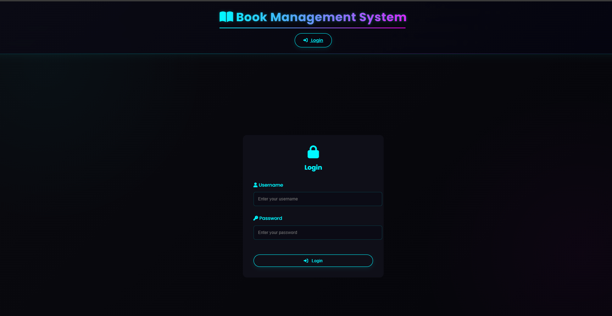
---

## 🚀 Features

- ✅ User login with session management (cookie-based)
- ✅ Create, read, update, and delete (CRUD) book reviews
- ✅ Secure sessions with configurable `secret_key`
- ✅ Client-side and server-side input validation
- ✅ Custom 404 and error pages
- ✅ Dockerized for deployment ease

---

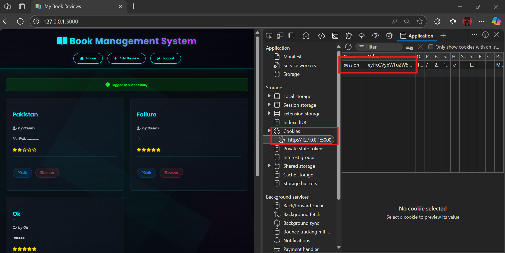

## 🛠️ Tech Stack

- **Backend**: Python 3.9+, Flask
- **Frontend**: Jinja2 Templates, HTML/CSS (Bootstrap optional)
- **Database**: SQLite
- **Containerization**: Docker

---

## ⚙️ Setup & Running

### 📦 Prerequisites

- [Docker](https://www.docker.com/) (for containerized setup)
- Or, Python 3.9+ & pip (for local setup)

---

### 🔧 Installation

#### 🔹 Clone the repository

```
git clone https://github.com/Basim-Mehdi/SSDD-Lab.git
cd SSDD-Lab 
````
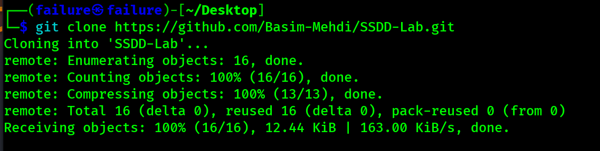
---

### 🐳 Run with Docker

```
docker build -t book-review-system .
```

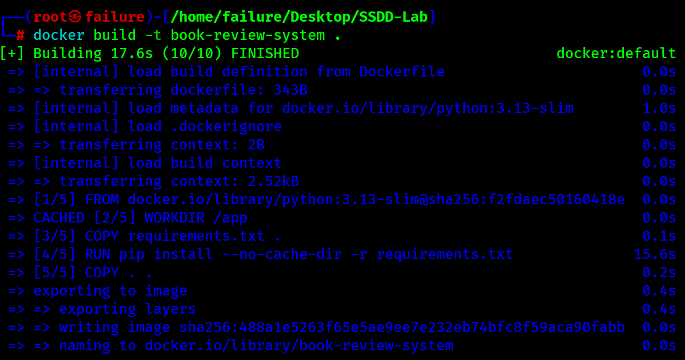

```
docker run -p 5000:5000 book-review-system
```

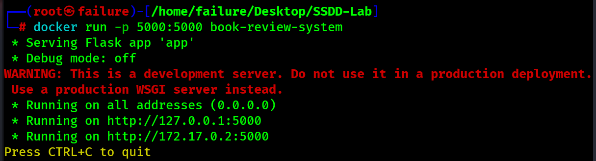

Open your browser: [http://localhost:5000](http://localhost:5000)
Default login credentials:

* **Username**: `admin`
* **Password**: `password`

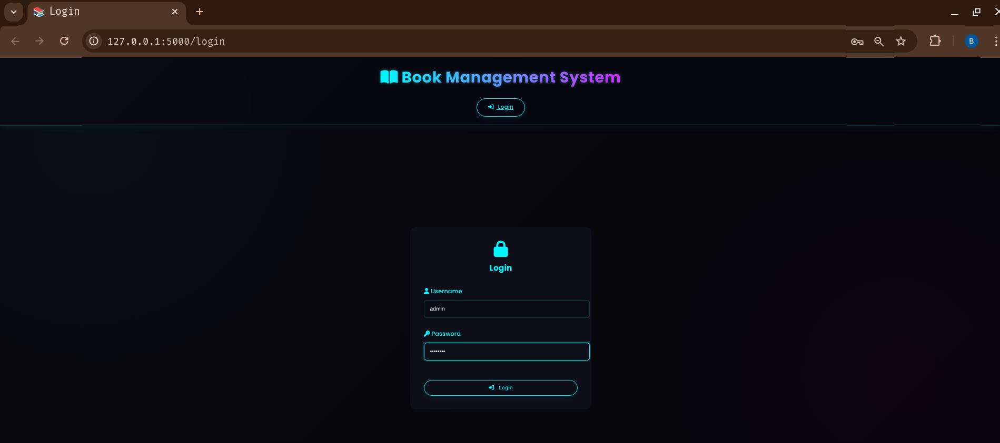
---

### 🖥️ Run Locally

```
pip install -r requirements.txt
```

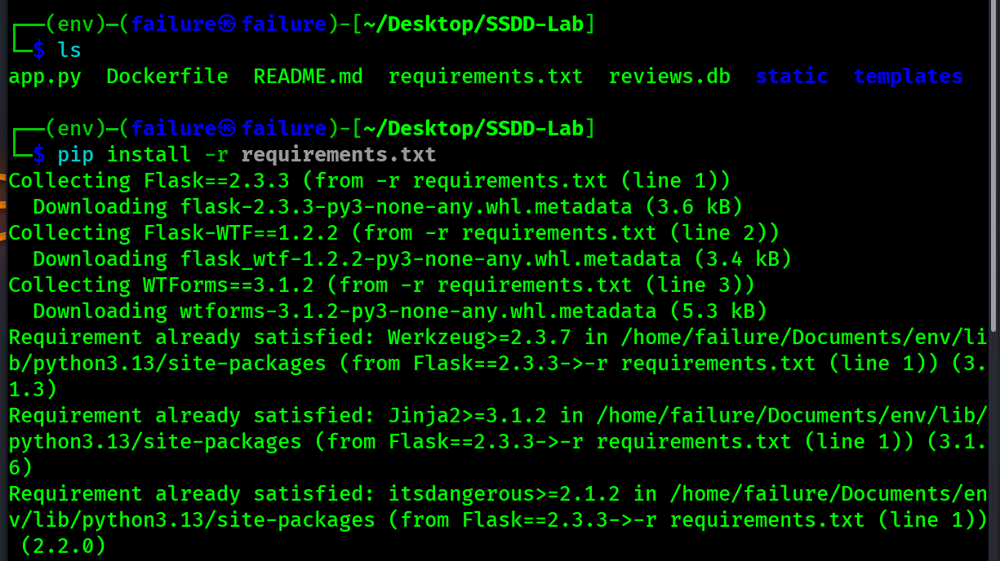

```
python app.py
```

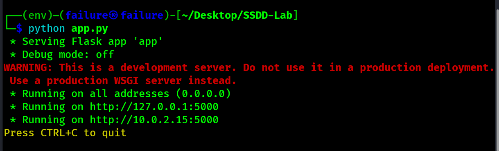

Ensure `app.secret_key` is securely set inside `app.py` or via environment variable `FLASK_SECRET_KEY`.

---

## 🧪 Testing (Manual)

### 1. Log in using the default credentials.  

   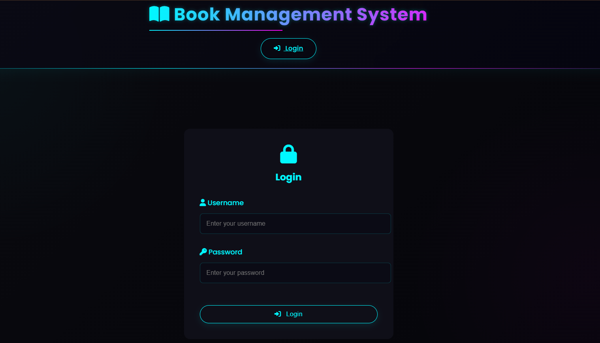

   - Base page with a navigation bar at the top for easy and intuitive use.

   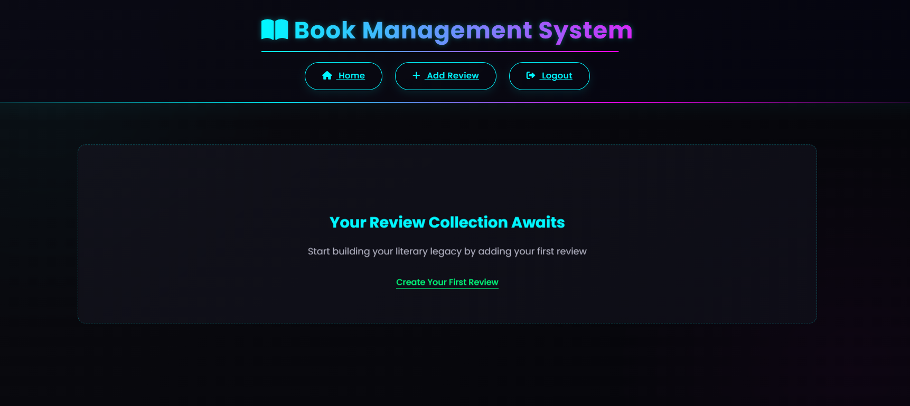


### 2. Add a new book review.

   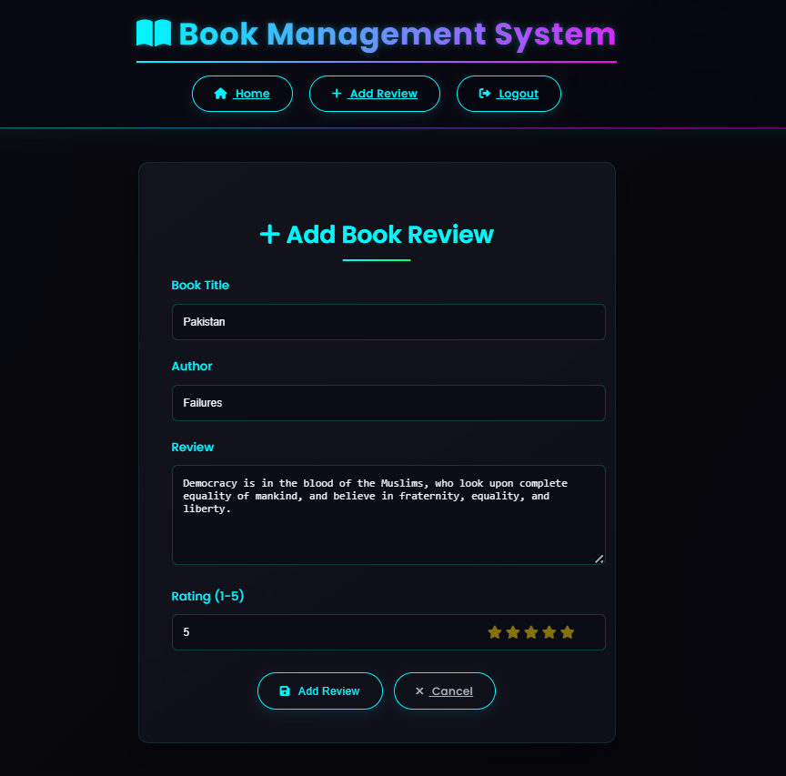

   ** - Successfully Added Review:**

   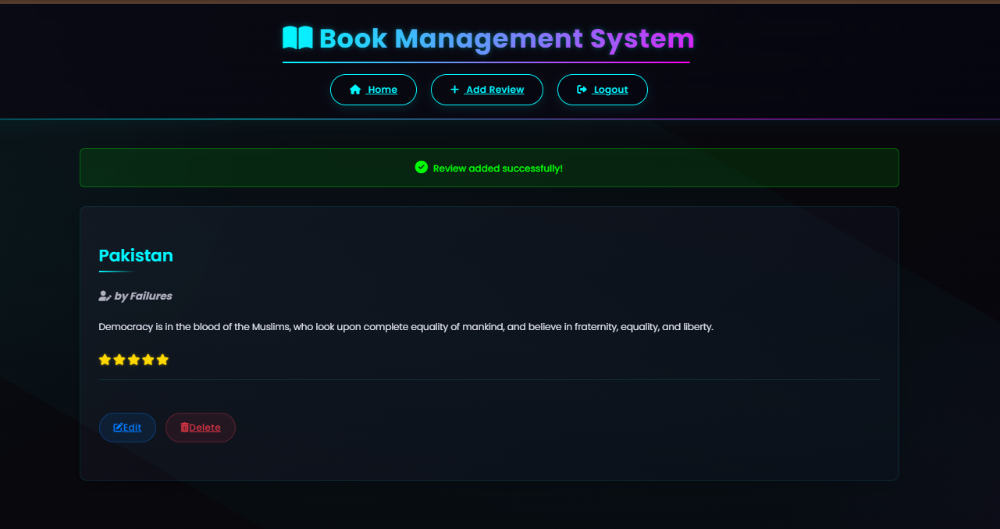

### 3. Edit the review.

   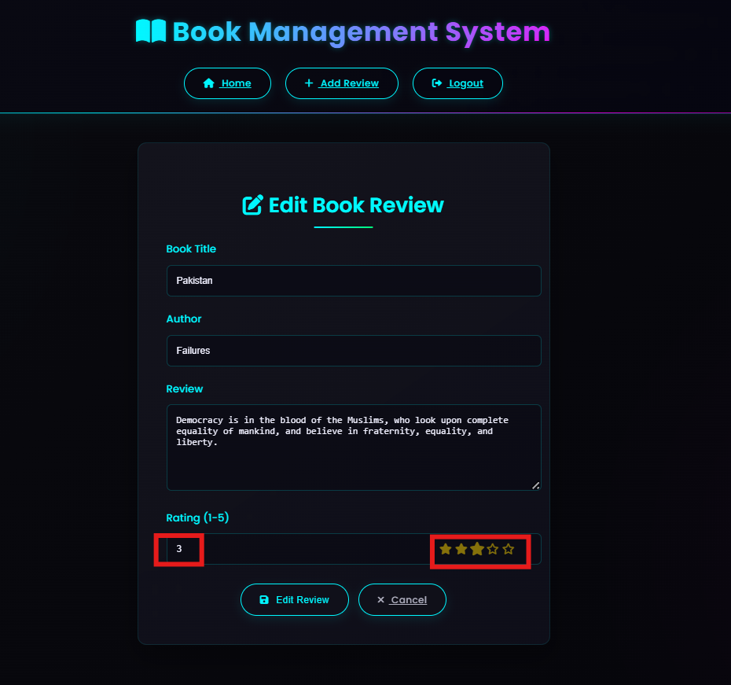

   ** - Successfully Editted:**

   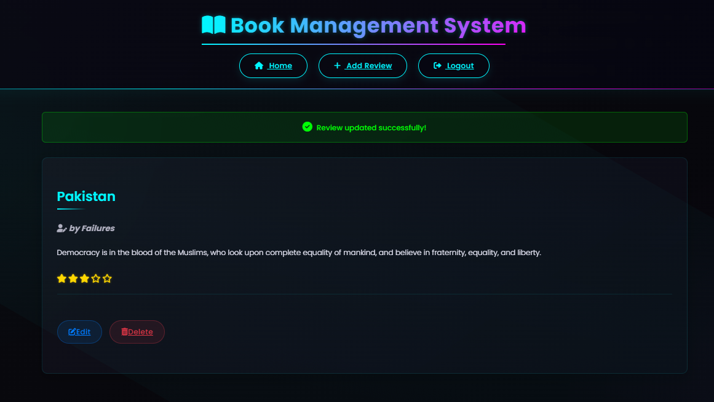

### 4. Delete the review.

   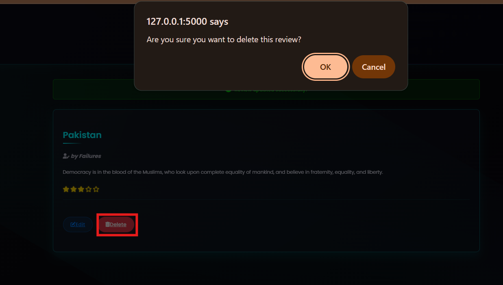

   ** - Successfully Deleted: **

   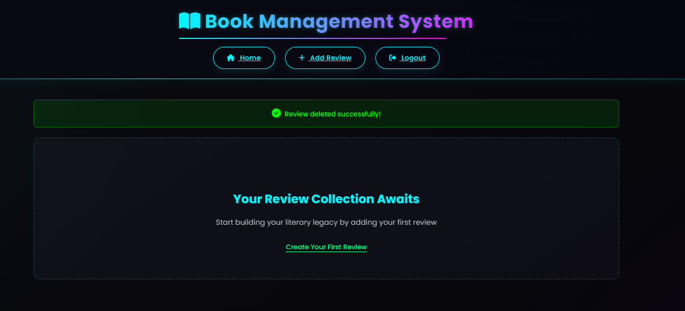

### 5. Test invalid inputs for form validation.

   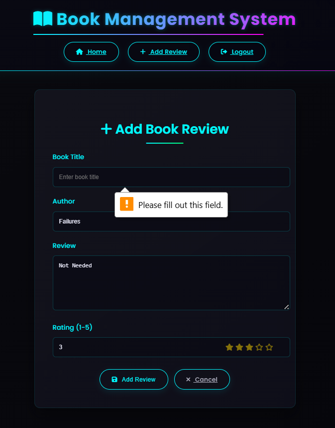

### 6. Try accessing routes like `/session-info` without logging in/out to test session protection.

   ** - Logged Out:**

   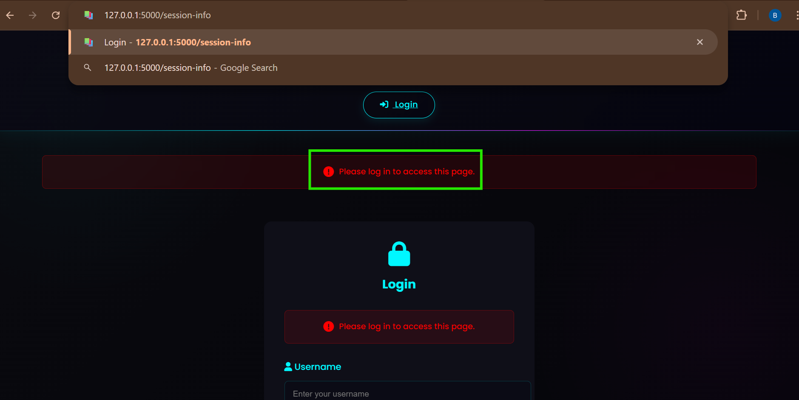

   ** - Logged In:**

   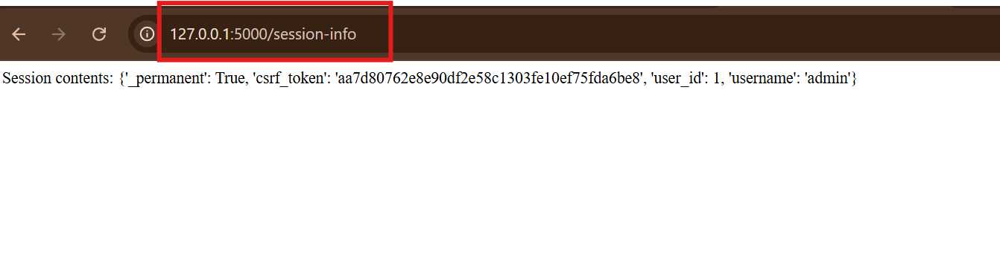

### 7. Visit a non-existent URL to see the custom error page.

   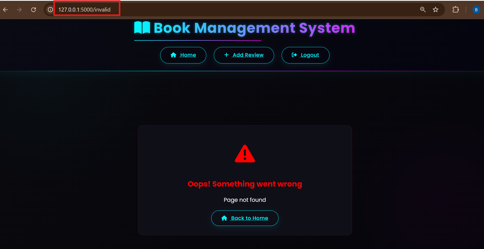

---

## 📊 UML Diagrams

Diagrams illustrating system design are available in the `diagrams/` folder:

* **Use Case Diagram**: User login, add/edit/delete review.
* **Class Diagram**: Classes like `User`, `Review`, `Session`.
* **Sequence Diagram**: Flow of adding a new review.

---

## 🛡️ Security Notes

* Sessions are stored in cookies and signed using `Flask.secret_key`
* Use `SESSION_COOKIE_SECURE=True` in production
* Update `secret_key` before deploying to prevent session hijacking

---

## 📁 Project Structure

```
book-review-system/
│
├── app.py                 # Main Flask application file
├── requirements.txt       # Python dependencies
├── Dockerfile             # Docker image build configuration
│
├── templates/             # Jinja2 HTML templates
│   ├── home.html          # Dashboard for viewing user reviews
│   ├── login.html         # User login page
│   ├── review_form.html   # Add/Edit review form
|   ├── base.html          # Base form
│   └── error.html         # Custom error page
│
├── static/                # Static files
│   ├── css/
│        └── neon.css      # Custom styling
│
├── diagrams/              # UML diagrams (PlantUML format)
│   ├── use_case.png      # Use Case Diagram
│   ├── class_diagram.png # Class Diagram
│   └── sequence.png      # Sequence Diagram for review flow
│
└── README.md              # Project documentation (you're reading it!)
```

---


## 💡 Credits

**👨‍💻 Developed by:**

- [**Basim Mehdi**](https://github.com/Basim-Mehdi)
- [**Shaheer Sheri**](https://github.com/Shaheer-Sheri)
- [**Khattak761**](https://github.com/Khattak761)


